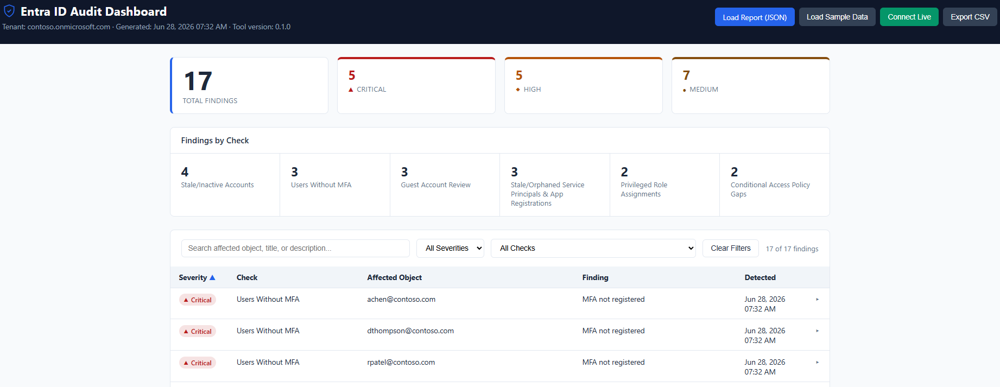

# Entra ID Audit Tool

[](.github/workflows/pester-tests.yml)
[](LICENSE)
[](https://github.com/Josperdo/entra-id-audit-tool/commits/main)

Automated identity governance audit dashboard for Azure/Entra ID.



## Why This Exists

Identity sprawl is one of the most common root causes behind cloud security incidents — stale guest accounts, users without MFA, orphaned admin roles, and over-privileged service principals accumulate silently in most Entra ID tenants. Manually auditing these conditions through the Azure portal doesn't scale and is easy to skip. This tool automates a repeatable identity governance audit against Microsoft Graph so findings are consistent, documented, and reviewable over time.

## What It Does

The tool runs six audit checks against a tenant via Microsoft Graph API and produces a structured report:

1. **Stale/inactive accounts** — users with no sign-in activity past a defined threshold
2. **Users without MFA** — accounts not enrolled in multi-factor authentication
3. **Guest account review** — external/guest accounts and their access scope
4. **Privileged role assignments** — users holding admin roles (Global Admin, Privileged Role Admin, etc.)
5. **Stale/orphaned service principals & app registrations** — unused or overly permissioned apps
6. **Conditional Access policy gaps** — coverage gaps in CA policy enforcement

Results are exported to JSON and rendered in a self-contained HTML dashboard for review. The dashboard can also run entirely in the browser via **Live Mode** — see below — calling Microsoft Graph directly instead of loading a pre-generated report.

## Quick Start

> Full setup instructions: see [SETUP.md](SETUP.md)

```powershell
# Install dependencies
Install-Module Microsoft.Graph -Scope CurrentUser

# Run the audit
.\scripts\Invoke-EntraAudit.ps1 -ConfigPath .\scripts\config\audit-config.json

# Open the dashboard
.\dashboard\index.html
```

### Live Mode (optional)

Instead of running the PowerShell script, the dashboard can authenticate to Entra ID itself and call Graph directly. This requires serving it over `http://` (MSAL.js browser auth doesn't work via `file://`) and a SPA platform on your App Registration — see [SETUP.md](SETUP.md#4-spa-app-registration-setup-live-dashboard-mode):

```powershell
npx serve dashboard
# open http://localhost:5500 and click "Connect Live"
```

## Known Limitations

- **Stale/inactive accounts**, **users without MFA**, and **guest account review** rely on the `signInActivity` property and the `userRegistrationDetails` report, both of which require an **Azure AD Premium P1 or P2** license on the tenant. On tenants without that license, Graph returns `403 Forbidden` (`Authentication_RequestFromNonPremiumTenantOrB2CTenant`) for these checks and they're skipped — this is a Graph API licensing restriction, not a bug in the tool. This applies identically in Live Mode, surfaced per-check in the live-status panel rather than blocking the other 3 checks.
- **Live Mode requires local `http(s)` hosting**, not a `file://` URL, since MSAL.js's browser auth flow needs a real origin. File-upload and sample-data modes are unaffected and still need no server.

## Documentation

- [SETUP.md](SETUP.md) — prerequisites and local setup
- [TECHNICAL.md](TECHNICAL.md) — architecture and design decisions
- [AUDIT-CHECKS.md](AUDIT-CHECKS.md) — details on each audit check
- [CLOUD.md](CLOUD.md) — cloud architecture and integration notes
